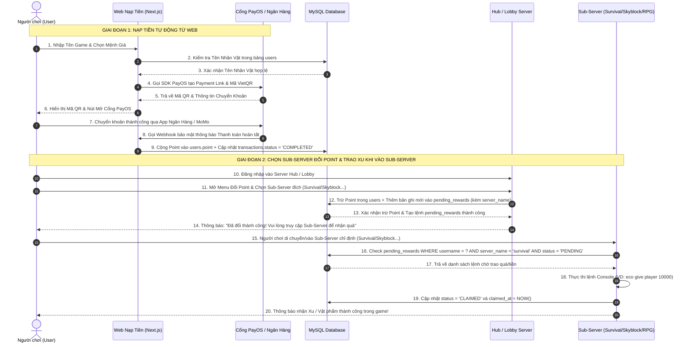

# 🎮 HỆ THỐNG NẠP TIỀN & TÍCH HỢP GAME MINECRAFT SERVER

Tài liệu chi tiết cấu trúc **Database Schema** và **Workflow Tích Hợp** giữa Website Nạp Tiền (Next.js) và Minecraft Multi-Server (Hub/Lobby & các Sub-servers).

---

## 📑 MỤC LỤC
1. [Cấu Trúc Cơ Sở Dữ Liệu (Database Schemas)](#1-cấu-trúc-cơ-sở-dữ-liệu-database-schemas)
2. [Workflow Tổng Quan Hệ Thống (Sequence Diagram)](#2-workflow-tổng-quan-hệ-thống)
3. [Chi Tiết Quy Trình Đổi Point & Trao Xu Tại Sub-Server](#3-chi-tiết-quy-trình-đổi-point--trao-xu-tại-sub-server)
4. [Danh Sách API Endpoints (Next.js Server)](#4-danh-sách-api-endpoints-nextjs-server)
5. [Cấu Hình Biến Môi Trường (.env)](#5-cấu-hình-biến-môi-trường-env)

---

## 1. 🗄️ CẤU TRÚC CƠ SỞ DỮ LIỆU (DATABASE SCHEMAS)

Cơ sở dữ liệu MySQL được chia sẻ dùng chung giữa Web Next.js, Hub/Lobby Server và các Sub-Servers.

### 1.1 Bảng `users` (Tài khoản người chơi Minecraft)
Lưu trữ thông tin tài khoản nhân vật game và số dư **Point** tích lũy được nạp từ Web.

```sql
CREATE TABLE `users` (
  `id` INT UNSIGNED AUTO_INCREMENT PRIMARY KEY,
  `username` VARCHAR(255) CHARACTER SET utf8mb3 COLLATE utf8mb3_general_ci NOT NULL UNIQUE,
  `realname` VARCHAR(255) NOT NULL,
  `password` VARCHAR(255) DEFAULT NULL,
  `ip` VARCHAR(45) DEFAULT NULL,
  `lastlogin` BIGINT DEFAULT NULL,
  `point` BIGINT NOT NULL DEFAULT 0, -- Số dư Point khả dụng (Nạp từ Web)
  `created_at` DATETIME NOT NULL DEFAULT CURRENT_TIMESTAMP,
  `updated_at` DATETIME NOT NULL DEFAULT CURRENT_TIMESTAMP ON UPDATE CURRENT_TIMESTAMP,
  INDEX `idx_username` (`username`)
) ENGINE=InnoDB DEFAULT CHARSET=utf8mb4;
```

---

### 1.2 Bảng `transactions` (Lịch sử giao dịch nạp tiền VietQR / PayOS)
Lưu nhật ký tất cả các đơn khởi tạo nạp tiền, trạng thái giao dịch và mã đối soát PayOS.

```sql
CREATE TABLE `transactions` (
  `id` BIGINT UNSIGNED AUTO_INCREMENT PRIMARY KEY,
  `order_code` VARCHAR(64) NOT NULL UNIQUE, -- Mã đơn nạp duy nhất (VD: TX9888387121)
  `username` VARCHAR(255) CHARACTER SET utf8mb3 COLLATE utf8mb3_general_ci NOT NULL,
  `amount` DECIMAL(15, 2) NOT NULL, -- Số tiền VNĐ người dùng nạp (VD: 50,000)
  `point_received` BIGINT NOT NULL, -- Số Point thực nhận (Đã tính % Khuyến mãi)
  `status` ENUM('PENDING', 'COMPLETED', 'EXPIRED', 'FAILED') NOT NULL DEFAULT 'PENDING',
  `payment_method` VARCHAR(50) DEFAULT 'BANK_TRANSFER',
  `description` VARCHAR(255) NULL,
  `created_at` DATETIME NOT NULL DEFAULT CURRENT_TIMESTAMP,
  `updated_at` DATETIME NOT NULL DEFAULT CURRENT_TIMESTAMP ON UPDATE CURRENT_TIMESTAMP,
  INDEX `idx_username` (`username`),
  INDEX `idx_order_code` (`order_code`),
  CONSTRAINT `fk_transactions_username` FOREIGN KEY (`username`) REFERENCES `users` (`username`) ON DELETE CASCADE ON UPDATE CASCADE
) ENGINE=InnoDB DEFAULT CHARSET=utf8mb4 COLLATE=utf8mb4_unicode_ci;
```

---

### 1.3 Bảng `pending_rewards` (Hàng chờ trao thưởng / Lệnh Console)
Lưu các lệnh chờ thực thi khi người chơi tham gia vào Sub-Server chỉ định (`server_name`).

```sql
CREATE TABLE `pending_rewards` (
  `id` BIGINT UNSIGNED AUTO_INCREMENT PRIMARY KEY,
  `username` VARCHAR(255) CHARACTER SET utf8mb3 COLLATE utf8mb3_general_ci NOT NULL,
  `server_name` VARCHAR(100) NOT NULL COMMENT 'Tên Sub-Server nhận thưởng (VD: survival, skyblock, rpg)',
  `command` VARCHAR(512) NOT NULL COMMENT 'Lệnh Console thực thi (VD: eco give %player% 10000)',
  `status` ENUM('PENDING', 'CLAIMED', 'CANCELLED') NOT NULL DEFAULT 'PENDING',
  `created_at` DATETIME NOT NULL DEFAULT CURRENT_TIMESTAMP,
  `claimed_at` DATETIME NULL,
  INDEX `idx_server_user_status` (`server_name`, `username`, `status`),
  CONSTRAINT `fk_pending_rewards_username` FOREIGN KEY (`username`) REFERENCES `users` (`username`) ON DELETE CASCADE ON UPDATE CASCADE
) ENGINE=InnoDB DEFAULT CHARSET=utf8mb4 COLLATE=utf8mb4_unicode_ci;
```

---

## 2. 🔄 WORKFLOW TỔNG QUAN HỆ THỐNG

Sơ đồ thể hiện luồng nạp tiền trên Web và luồng **Đổi Point tại Hub/Lobby $\rightarrow$ Ghi lệnh pending_rewards theo server_name $\rightarrow$ Người chơi vào Sub-Server để nhận**:



---

## 3. 🎯 CHI TIẾT QUY TRÌNH ĐỔI POINT & TRAO XU TẠI SUB-SERVER

### 3.1 Giai Đoạn Đổi Point (Tại Hub/Lobby Server)
1. **Người chơi truy cập Hub/Lobby**: Đăng nhập vào Server Hub/Lobby chính.
2. **Mở Menu Đổi Point**: Người chơi gõ lệnh `/doipoint` hoặc nhấp mở Menu NPC GUI.
3. **Chọn Sub-Server nhận thưởng**: Người chơi chọn Sub-Server mong muốn nhận quà (Ví dụ: `survival`, `skyblock`, `rpg`, v.v.).
4. **Thực thi SQL Transaction**:
   - Trừ số `point` tương ứng trong bảng `users`:
     ```sql
     UPDATE users SET point = point - 10 WHERE username = 'player1' AND point >= 10;
     ```
   - Chèn câu lệnh chờ vào bảng `pending_rewards` với cột `server_name` chỉ định:
     ```sql
     INSERT INTO pending_rewards (username, server_name, command, status)
     VALUES ('player1', 'survival', 'eco give player1 10000', 'PENDING');
     ```

---

### 3.2 Giai Đoạn Thực Thi Trao Quà (Khi Player Vào Sub-Server Target)
1. **Sự kiện người chơi tham gia Sub-Server** (`PlayerJoinEvent`):
   - Ngay khi người chơi kết nối vào Sub-Server `survival`, Plugin Sub-server lắng nghe sự kiện đăng nhập.
2. **Quét tìm lệnh chờ trao quà**:
   ```sql
   SELECT id, command FROM pending_rewards 
   WHERE username = 'player1' 
     AND server_name = 'survival' 
     AND status = 'PENDING';
   ```
3. **Thực thi lệnh Console & Đánh dấu hoàn tất**:
   - Chạy lệnh Console trao Xu/Vật phẩm trong Sub-server đó (VD: `eco give player1 10000`).
   - Cập nhật trạng thái thành đã nhận:
     ```sql
     UPDATE pending_rewards 
     SET status = 'CLAIMED', claimed_at = NOW() 
     WHERE id = ?;
     ```
   - Gửi thông báo ActionBar / Title / Chat chúc mừng người chơi trong game.

---

## 4. 🔗 DANH SÁCH API ENDPOINTS (NEXT.JS SERVER)

| Endpoint | Method | Chức Năng | Đã Hoàn Thành |
| :--- | :---: | :--- | :---: |
| `/api/user/check?username=...` | `GET` | Kiểm tra tên nhân vật có tồn tại trong bảng `users` | ✅ |
| `/api/deposit/create` | `POST` | Khởi tạo đơn nạp tiền VietQR & PayOS Payment Link | ✅ |
| `/api/deposit/status/[orderCode]` | `GET` | Polling trạng thái thanh toán của đơn nạp | ✅ |
| `/api/deposit/webhook` | `POST` | Nhận thông báo xác nhận thanh toán tự động từ PayOS | ✅ |
| `/api/deposit/cancel` | `POST` | Hủy đơn nạp & Hủy link thanh toán PayOS | ✅ |

---

## 5. ⚙️ CẤU HÌNH BIẾN MÔI TRƯỜNG (.ENV)

Chi tiết các biến môi trường cấu hình cho hệ thống:

```env
# ==========================================
# DATABASE MYSQL CONFIGURATION
# ==========================================
DB_HOST=127.0.0.1
DB_PORT=3306
DB_USER=root
DB_PASSWORD=your_mysql_password
DB_NAME=minecraft

# Optional Vercel / Cloud MySQL Connection Pool Tuning
DB_CONNECTION_LIMIT=3
DB_MAX_IDLE=2
DB_IDLE_TIMEOUT=30000
DB_SSL=false

# ==========================================
# VIETQR & BANK PAYMENT CONFIGURATION
# ==========================================
BANK_ID=MB
BANK_ACCOUNT_NO=0333333333
BANK_ACCOUNT_NAME=AETHERMINE SERVER
VIETQR_TEMPLATE=compact2
ORDER_PREFIX=TX

# ==========================================
# WEBHOOK SECURITY SECRET
# ==========================================
WEBHOOK_SECRET=aethermine_secret_key_2026

# ==========================================
# PAYOS PAYMENT GATEWAY CONFIGURATION
# ==========================================
PAYOS_CLIENT_ID=your_payos_client_id
PAYOS_API_KEY=your_payos_api_key
PAYOS_CHECKSUM_KEY=your_payos_checksum_key

# ==========================================
# POINT CONVERSION RATE & BONUS CONFIGURATION
# ==========================================
# Tỷ lệ quy đổi gốc (Mặc định 0.001: 10,000 VNĐ = 10 Point)
POINT_CONVERSION_RATE=0.001
NEXT_PUBLIC_POINT_CONVERSION_RATE=0.001

# Phần trăm thưởng khuyến mãi (Mặc định 20%)
POINT_BONUS_PERCENT=20
NEXT_PUBLIC_POINT_BONUS_PERCENT=20

# Số tiền nạp tối thiểu (Mặc định 10,000 VNĐ)
MIN_DEPOSIT_AMOUNT=10000
NEXT_PUBLIC_MIN_DEPOSIT_AMOUNT=10000
```
